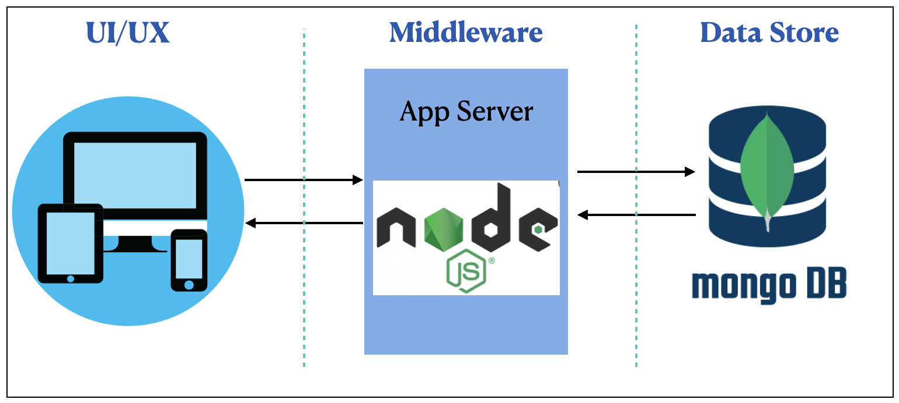

## Recipe Web App

This web app is a demo on implementing CRUD REST API'S and integration with front end using reactjs. Below are the functionality implementd in this app.

- Create/Register a new user with user name, password and email(no validation as of now).
- User login
- Create a simple recipe with title, type and cuisine of the recipe.
- Show list of all recipes created by a particular user
- Implemented both
  - frontend - react-js
  - backend - NodeJS
  - Database - MongoDB

## Prerequisites:

- Make sure MongoDB is running before starting the server

## How to start Server:

Make sure that Mongo DB database is up and running

1. Navigate to the `server` folder from the project root folder `portal`
2. Run `npm install` to install all dependencies
3. Run `npm run server.js` to start the server

## How to start Web App:

1. Navigate to the `webui` folder from the project root folder `portal`
2. Run `npm install` to install all dependencies
3. Run `npm start` to start Web App server
